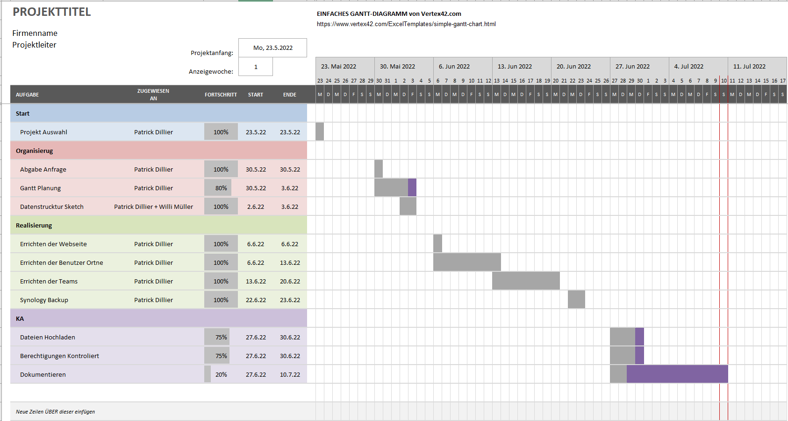

# Planen
In der Planung meines Projektes nahm ich mir das planungs Format GANTT als Grundlage. 
Ich habe dann eine vorlage aus dem Internet kopiert und diese abgeändert. 
Mit GANTT kann man sich in einer gewissen Zeitspanne 

