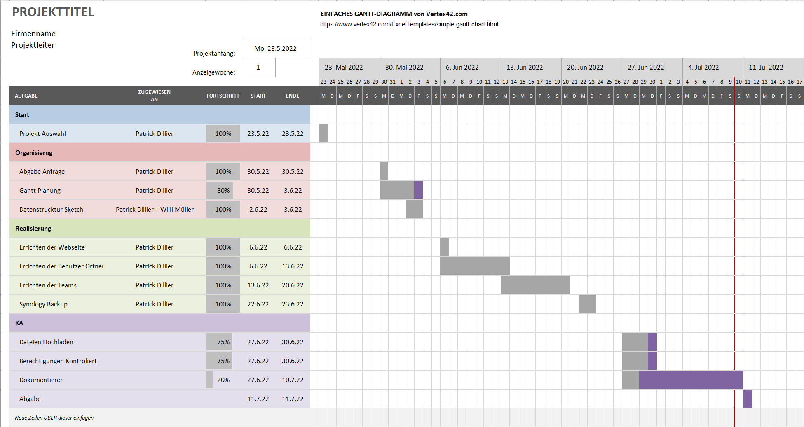

# Planen
In der Planung meines Projektes nahm ich mir das planungs Format GANTT als Grundlage. 
Ich habe dann eine vorlage aus dem Internet kopiert und diese abgeändert. 
## Erklärung
Mit GANTT kann man sich eine Struktur errichten, welche genutzt werden kann für die Planung eines Projektes. 
Es hilft, sich an einen Zeitplan zu halten und so, je nach planung des Projektes, nicht in eine Verspätung zu geraten. 

