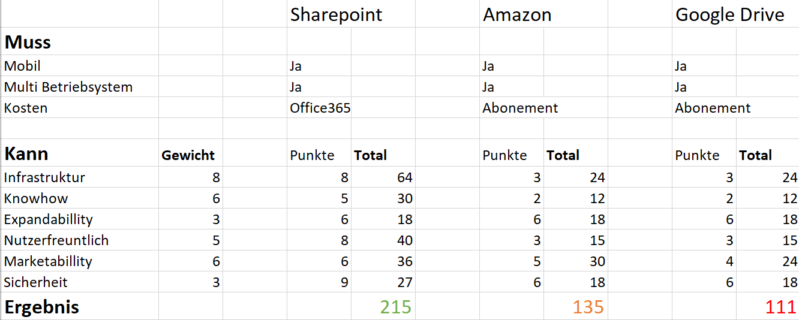

# Entscheiden

In dem Schritt "E" von IPERKA wird entschieden welche Methoden oder Möglichkeiten am geeignetsten ist für das  darauffolgende «R», wo man mit der ausgewählten Methode sein Projekt realisiert.

## Nutzwertanalyse 
Die Nutzwertanalyse ist eine Auswertungsmethode welche verschiedenen Möglichkeiten miteinander vergleicht. 
Bei mir waren es z.B: 3 verschiedene Creative Cloud Lösungen. 
Jene drei werden hier den gleichen Kriterien unterstellt.
Je nach Kriterium kann es eine Gewisse Gewichtung haben was so zusagen die Wichtigkeit des Kriteriums darstellt. 
Es wird dann eine Punktezahl vergeben wie sehr das Kriterium der, in meinem Fall, Cloud zusteht.
Gewicht und Punktestand wird dann multipliziert zu einem Total. 
Alle Totale werden dann addiert, um am Schluss das Ergebnis zu erhalten. 
Hier ein bild meiner Nutzwertanalyse

## Wahl