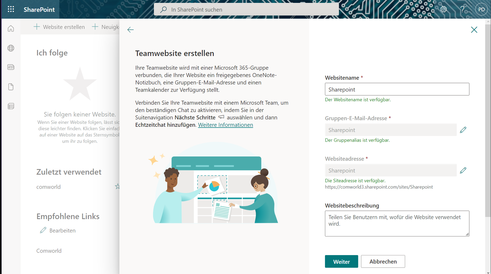
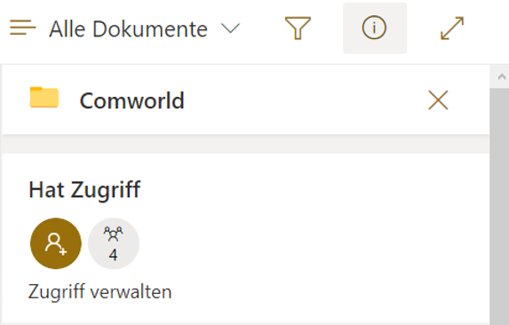

# Realisierung 
* [Einführung](#einführung) 
* [Basis Struktur](#basis-struktur)
* [Website](#webseite)
* []

## Einführung 

Im Ersten Schritt «I» Informieren musste man sich inspirieren lassen oder herausfinden was für ein Projekt man machen wolle. 
Bei mir war das sehr leicht da mein Chef sich eine Sharepoint Cloud wünschte und ich früher oder später hin oder her  eine mal errichten müsste.  

Sharepoint ist eine Applikation, welche auf dem von Microsoft entwickeltem Office aufgebaut ist. 
Nutzen kann man es nur solange man einen Microsoft Account mit einer gültigen Office 365 Lizenz hat.  
Man nutzt es, um eine Webseite zu errichten wo sich Gruppen zum einen Unterhalten und Arbeiten Können. 

Wir werden das volle Potenzial von Sharepoint in diesem Projekt nicht ausschöpfen.  

Wir werden in Sharepoint eine Ortner Struktur errichten, dort bestimmte Berechtigungen vergeben und dies dann auf  Onedrive freigeben. 

So durch kann man in einem Geschäft daten in einer Cloud teilen aber auch seinen eigenen Privaten Cloudspeicher nutzen. 

Als Abschluss wird die Sharepoint Webseite und alle Daten noch auf das NAS der Firma Comworld gesichert im falle von  menschlichem Versagen.

## Basis Struktur

Nach einem Gespräch mit meinem Chef über die Struktur und die Berechtigungen entschieden wir uns auf etwas Simples.
 
 

 

Verlangt war lediglich ein Root Ortner «Comworld» darunter 2 Ortner für angestellte «Patrick», «Kevin», einen für «Anleitungen», und einen «Projekte», wo wir einzelne Informationen für Kunden zwischenspeichern. 

«Projekte» und «Anleitungen» sollten alle Zugriffe darauf haben. 
Die Mitarbeiter Ordner sollten nur die Mitarbeiter zugriff haben 

## Webseite 

Zum Erstellen einer Sharepoint Webseite sollte man manche Einzelheiten vorbereitet haben.
•	Einen Microsoft Account
•	Office 365 Administration und Sharepoint Admin Rechte
•	Knowhow

Der erste schritt ist im Office 365 Admin Center eine Gruppe zu erstellen mit den verlangten Teilnehmern der Daten-Struktur.
Danach folgt die Erstellung der Webseite selbst.
Welche man im Sharepoint selbst macht.

Der erste schritt ist somit auch der wichtigste.
Ich habe mich dort für Teamwebseite entschieden.

### Dies sind meine einstellungen.
 

## Datenstrucktur

Dass erstellen der Daten Struktur ist von hier aus keine grosse Sache mehr da von hier aus die Ortner Per GUI erstellbar sind. 
Auf dem Root Ortner Comworld entferne ich alle Berechtigungen und füge die Gruppe hinzu die ich Office 365 Admin Center erstellt habe. 

 

Darunter folgt der Rest der Ortner. 
Bei den beiden Ortner der Mitarbeiter entferne ich die Gruppe und füge die übereinstimmenden Nutzer per Mail hinzu. 

## Onedrive
Nun kann man noch die Daten Struktur mit Onedrive verbinden.
