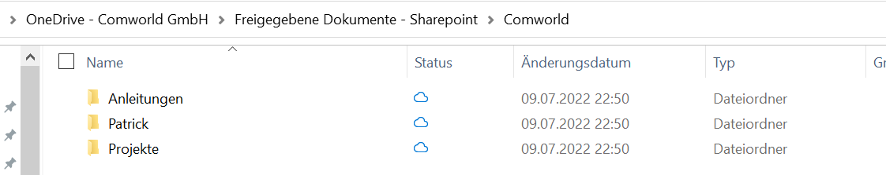

# Kontrollieren
In diesem Schritt wird angeschaut und kontroliert was im Schritt «R» Realisieren geleistet wurde. 
Man Kontrolliert nach den Zielen aus «I» Informieren und der Planung aus «P» Planung

## Testen
Der Testprozess meiner Webseite befindet sich rein nur im Spektrum Berechtigungen und Synchronisierung.
Im bereich Berechtigungen hat mein Chef voll zugriff auf alles. 

### **Berechtigungen:**

Das Obere zeigt das ich weder noch zugriff noch einsicht auf den Ortner Kevin habe.

**Beweis:** 
Dies ist ein Bild meines Onedrive Ortners.

### **Synchronisierung**

Ich nahm hier bei diesem Schritt die Möglichkeit und nutzte die Cloud um zwischen meinem PC "Arbeitsstelle" und Laptop "Speicherort des Repositorys" daten wie Bilder für die Dokumentation hin und her zu schieben. Viele daten sind noch nicht vorhanden ausser welche die ich nutzen musste für mein Projekt. 
Ich kann mit aus eigener Erfahrung sagen das sie Synchronisation von Onedrive zu Sharepoint in die Cloud tadellos funktioniert
